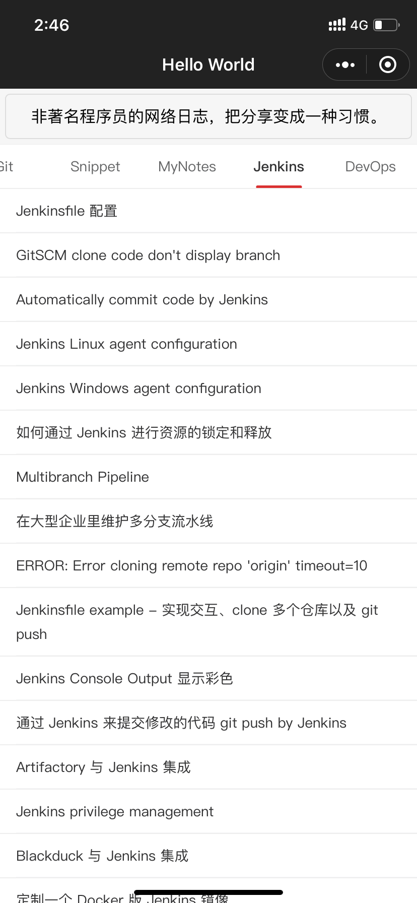

# `blog-applet`

这是我的 Hexo [博客](http://shenxianpeng.github.io/) 的微信小程序，参考了 [WeHexo](https://github.com/HunterXuan/WeHexo).

在使用之前需要先开启 Hexo 的 REST API 功能，即安装 [hexo-generator-restful](https://www.npmjs.com/package/hexo-generator-restful) 插件。

## 最终效果

扫二维码可以看到最终效果

附一张效果截图

## 存在的问题

1. UI 简洁但不够美观
2. 小程序打开速度很慢，可能是国内访问 GitHub Page 速度慢的问题。

